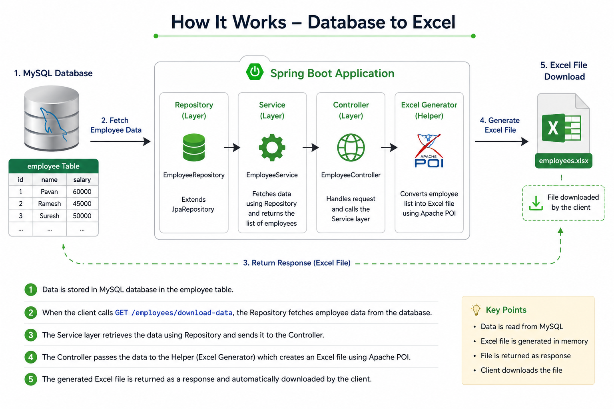
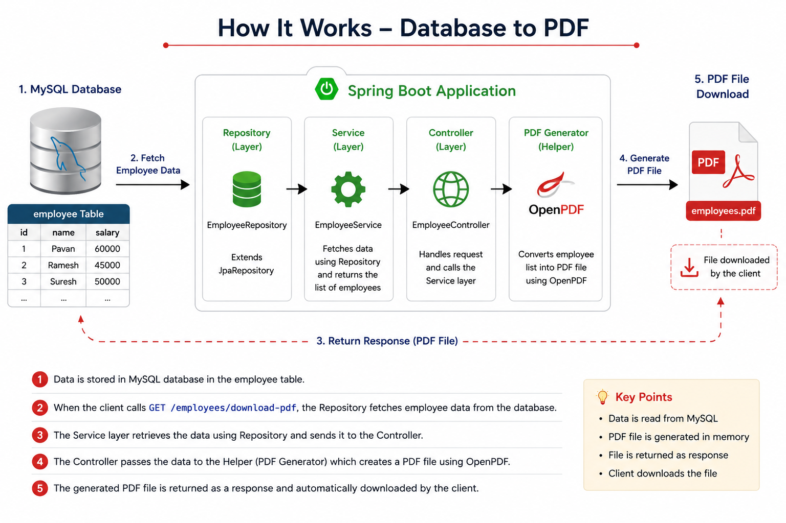

# 📊 Spring Boot: Database to Excel & PDF

A Spring Boot REST API application that exports employee data from a MySQL database into **Excel (.xlsx)** and **PDF (.pdf)** files. The generated files can be downloaded directly through REST endpoints using Apache POI for Excel generation and OpenPDF for PDF generation.

---

## ⚙️ What This Covers

✔ Fetch employee records from MySQL

✔ Generate Excel files using Apache POI

✔ Generate PDF files using OpenPDF

✔ Download files through REST APIs

---

## 🛠️ Tech Stack

| Category             | Technologies                          |
| -------------------- | ------------------------------------- |
| **Backend**          | Java 17, Spring Boot, Spring Data JPA |
| **Database**         | MySQL                                 |
| **Excel Processing** | Apache POI                            |
| **PDF Generation**   | OpenPDF                               |
| **Build Tool**       | Maven                                 |

---

## 📡 REST API Endpoints

| Method | Endpoint                   | Description                                                             |
| ------ | -------------------------- | ----------------------------------------------------------------------- |
| GET    | `/employees/download-data` | Exports employee records from MySQL and downloads them as an Excel file |
| GET    | `/employees/download-pdf`  | Exports employee records from MySQL and downloads them as a PDF file    |
---

## 🚀 How it Works

  

  

---

## 🎯 Conclusion

👉 *This repository demonstrates how to export data from a MySQL database into Excel and PDF files using Spring Boot. It provides a practical example of database integration, document generation, and file download functionality through REST APIs.*

---

⭐ Thank You for Visiting This Repository ⭐

